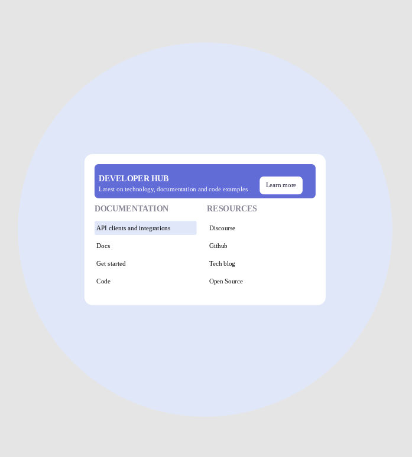

<h1 align="center">UI Design Daily - #1494 Menu</h1>

## Table of contents

- [Overview](#overview)
- [Screenshots](#screenshots)
- [Links](#links)
- [Continued Development](#continued-development)
- [Useful Resources](#useful-resources)

## Overview

[UI Design Daily design](https://www.uidesigndaily.com/posts/figma-menu-card-day-1494) translated to real code.  

## Screenshots

## Links

- [Github Pages](https://jdegand.github.io/ui-menu-card-day-1494)

## Continued Development

- the design is not practical for mobile screens 
- better to drop the circle entirely for smaller screens? The circle is just presentational.
- to keep same proportions on mobile - text would be 8px
- semantic html & accessibility 

## Useful Resources

- [Stack Overflow](https://stackoverflow.com/questions/34788537/responsive-circle-with-centered-content) - responsive circle
- [Stack Overflow](https://stackoverflow.com/questions/9358882/how-to-make-a-circle-around-content-using-css/9359039#9359039) - circle around content
